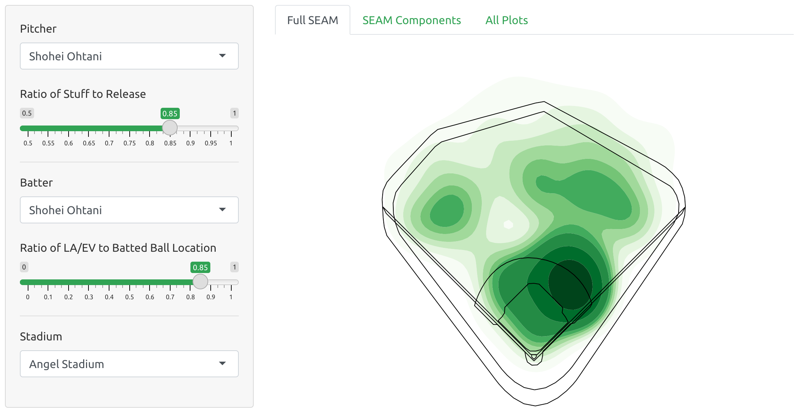

```{css, echo = FALSE}
a {color: #31a354;}
```

[](https://seam.stat.illinois.edu/app/)

> The SEAM (**s**ynthetic **e**stimated **a**verage **m**atchup) application allows users to visualize synthetic spray chart distributions (batted-ball distributions) for any MLB batter-pitcher matchup that has occurred or *could have occurred*^[As of SEAM 2.0, in addition to *possible* matchups that have not occurred, **impossible** matchups such as Shohei Ohtani (pitcher) versus Shohei Ohtani (batter) are estimable.] in the last four years.

## Information

- [**SEAM 2.0 Shiny Application**](https://seam.stat.illinois.edu/app/) [ [Source @ GitHub](https://github.com/ecklab/seam/) ]
- [SEAM 1.0 Article Preprint PDF](https://github.com/ecklab/seam-manuscript/blob/main/seam.pdf)
- [SEAM 1.0 Fangraphs Article](https://community.fangraphs.com/seam-methodology-for-player-matchup-evaluations/)

## Authors

- [Julia Wapner]()
  - Undergrad Student, Department of Statistics @ Illinois
  - Former Analyst, Illini Baseball
- [David Dalpiaz](https://daviddalpiaz.org/)
  - Assistant Teaching Professor, Department of Statistics @ Illinois
- [Daniel J. Eck](https://publish.illinois.edu/danieleck/)
  - Assistant Professor, Department of Statistics @ Illinois

## Acknowledgments

This work is supported by:

- [ATLAS Infrastructure](https://atlas.illinois.edu/)

This work was improved by helpful comments and feedback from: [Alan Nathan](http://baseball.physics.illinois.edu/), [John Marden](http://www.stat.istics.net/), [James Balamuta](https://www.thecoatlessprofessor.com/), [Dave Zhao](https://stat.illinois.edu/directory/profile/sdzhao)

